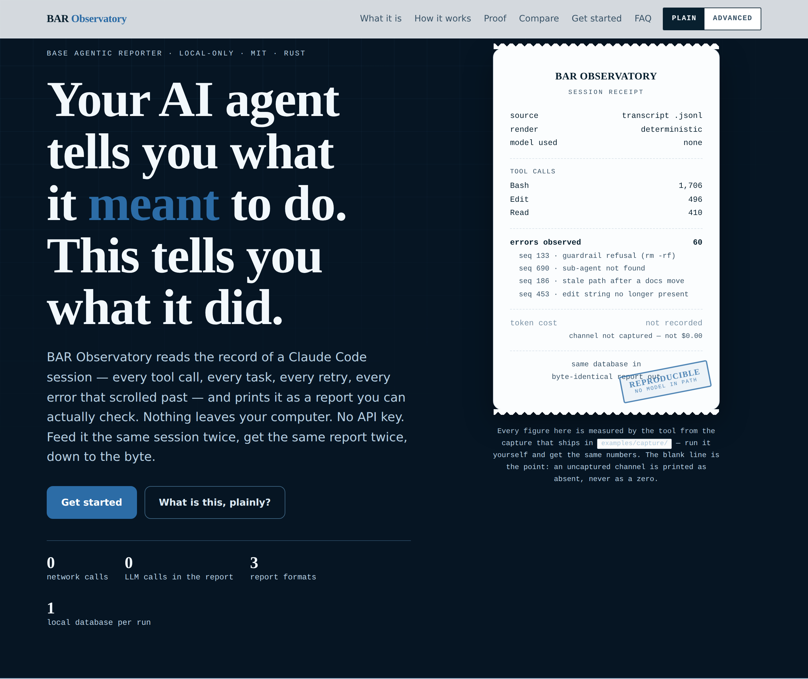
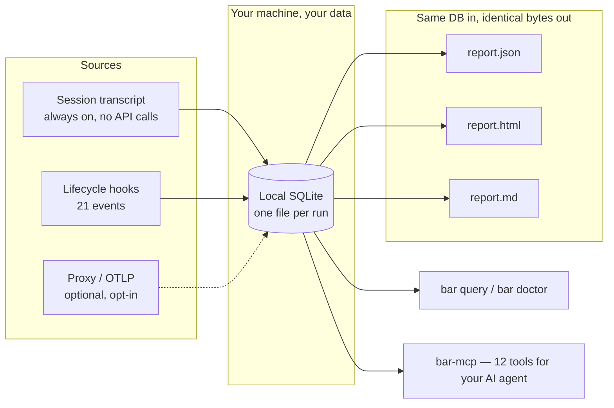
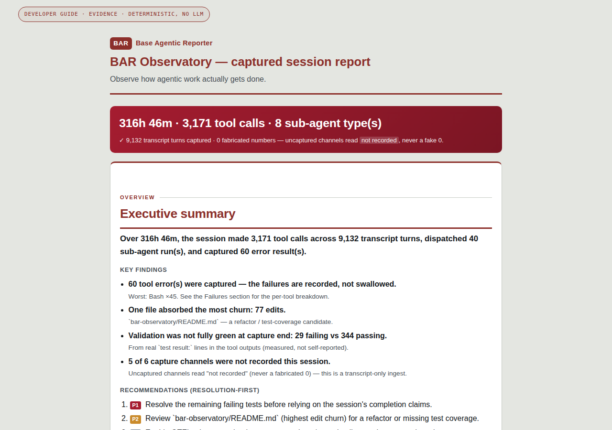
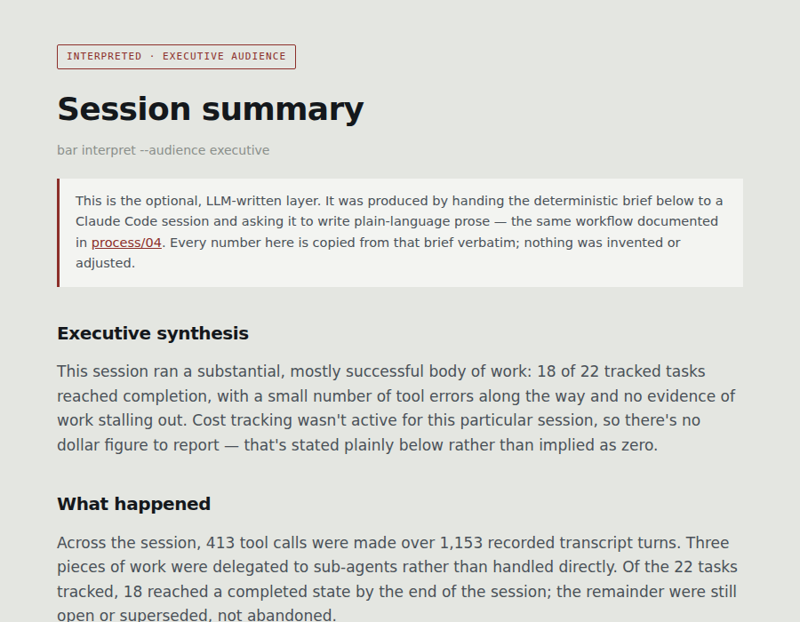

# BAR Observatory — Deterministic Audit Reports for Claude Code AI Agent Sessions

[](https://crates.io/crates/bar-observatory)
[](LICENSE)
[](https://www.rust-lang.org/)
[](#does-bar-observatory-send-my-code-anywhere)
[](#for-ai-agents-read-your-own-session-over-mcp)



**BAR Observatory (Base Agentic Reporter) is a free, open-source, local-only flight recorder and
audit tool for Claude Code sessions.** It reads what your AI coding agent actually did — every
tool call, task, sub-agent dispatch, rework loop, and error — stores it in a local SQLite
database, and renders a **deterministic report** in JSON, HTML, and Markdown. Same database in,
byte-identical report out, every time. No LLM in the render path. No network calls. No API key.
No account. *(The optional `bar interpret` command is the one exception — it uses your own
Claude Code session to write a plain-English summary. The deterministic report never depends on
it and never calls a model itself.)*

> **Don't ask the agent what happened. Check the record.**

> **TL;DR** — If you've ever finished a long Claude Code session and thought *"what did it
> actually do in there, and can I prove it?"*, run one command against the transcript you already
> have on disk and get a report you can attach to a PR, hand to a reviewer, keep as part of your
> own review process, or let another AI agent query directly. You do **not** need to clone or
> build this repository to do any of that — see [Zero-SDK, zero-clone](#zero-sdk-zero-clone)
> below.

**New to command lines?** This page covers everything in depth, including some technical detail
meant for engineers evaluating the tool. If you'd rather follow a slower, plain-language,
click-along guide with no assumed background — including how to open a terminal in the first
place — start with **[the plain-language guide](wiki/human-md/README.md)** instead, then come back
here any time.

**Jump to:** [Zero-SDK, zero-clone](#zero-sdk-zero-clone) ·
[Quickstart](#quickstart-your-first-report-in-about-60-seconds) ·
[How it works](#how-does-bar-observatory-work) ·
[What's in a report](#what-does-a-bar-observatory-report-contain) ·
[Comparison](#how-is-bar-observatory-different-from-langfuse-signoz-or-a-live-dashboard) ·
[Use cases](#core-use-cases) · [For AI agents](#for-ai-agents-read-your-own-session-over-mcp) ·
[FAQ](#faq) · [Limits](#what-does-bar-observatory-not-see) ·
[Recommended reading](#recommended-reading) ·
[About the author](#about-the-author) · [Acknowledgements](#acknowledgements)

---

## What problem does BAR Observatory solve?

An agentic coding session is a black box that scrolls past. A single Claude Code run can fire
hundreds of tool calls, spawn sub-agents that work invisibly, retry the same file four times, hit
a timeout partway through, and still end with a confident summary of what it accomplished. The
transcript holds the truth, but nobody reads a multi-thousand-turn log file by hand.

Three things break as a result:

1. **You can't verify the agent's own summary.** The agent tells you what it *intended*. The
   transcript records what it *did*. Those are different documents.
2. **Failures get swallowed.** Errors three sub-agents deep scroll past and are gone by the time
   they matter.
3. **There's no artifact.** Nothing to attach to a PR, hand to a reviewer, show an auditor, or
   compare against last week's run.

BAR Observatory turns the session record into a **receipt**: a stable, reproducible document
where every claim resolves to a real, recorded fact — and where anything it *couldn't* observe is
labeled `not_observed` rather than quietly reported as zero.

## Zero-SDK, zero-clone

Two separate claims worth stating plainly, because one explains most of what follows:

- **Zero-SDK.** Nothing to `import`, no decorator, no line added to your project's own source.
  BAR Observatory watches the Claude Code session, not your codebase — your repository is
  untouched, and stays untouched if you uninstall.
- **Zero-clone.** You do not need to clone or build *this* repository either. `cargo install
  bar-observatory` or the Claude Code plugin gets you the whole tool; this repo is the front
  door, documentation, and plugin assets, not something you check out to run BAR Observatory.

Put together, this is also *why* the primary path works retroactively, why there's no server to
run, and why the network-calls badge above reads zero: there's no SDK boundary to cross and no
build step in the way, so there's nothing to bootstrap before pointing BAR at a transcript you
already have.

## Quickstart: your first report in about 60 seconds

The front door is the Claude Code plugin — type these three lines inside your session:

```
/plugin marketplace add bar181/bar-observatory
/plugin install bar-observatory@bar-observatory
/bar-init
```

That wires all **21 lifecycle hooks** and the read-only MCP server for you — no hand-editing hook
settings, no manual `claude mcp add` — and adds five slash commands so setup and reporting happen
inside your session instead of a terminal round-trip:

| Command | What it does |
| --- | --- |
| `/bar-init` | **Start here.** Set up `.bar/` for this project (idempotent, safe to re-run) |
| `/bar-report` | Generate the deterministic report (JSON + HTML + MD) |
| `/bar-interpret` | Generate the optional interpreted self-improvement report (engineering or executive) |
| `/bar-doctor` | Live health check — is the recorder actually working? |
| `/bar-query` | Direct read-only DB access — tools, timeline, errors, or raw SQL |

The plugin needs the binaries on `PATH` (one line, once — no Rust yet? `curl
https://sh.rustup.rs -sSf | sh` gets you `cargo` in about a minute):

```bash
cargo install bar-hook bar-mcp bar-observatory
```

> **Disclosed gap, not an oversight:** the plugin currently resolves `bar-hook` / `bar-mcp` via
> `PATH` rather than shipping a bundled per-platform binary, because no release pipeline
> assembles them into the plugin zip yet. Hook commands Claude Code can't resolve fail harmlessly
> and never block a session — so plugin-before-binaries or binaries-before-plugin are both safe.

> **No GitHub access, or trying this from a local clone before you rely on the public repo?**
> `/plugin marketplace add` accepts a local folder path just as well as a GitHub reference —
> `/plugin marketplace add /path/to/bar-observatory` works identically, with no network call at
> all. The second and third lines (`/plugin install …`, `/bar-init`) are unchanged either way.

You do **not** need a live capture running first. The primary capture path parses a transcript
Claude Code already wrote to disk, so your **very first report can be of a session you ran last
month** — just run `/bar-report` once the binaries are on `PATH`.

### Advanced: the CLI directly, no plugin

For scripting, CI, or if you'd rather not install a plugin at all — the same five steps by hand:

```bash
# 1. Install the CLI
cargo install bar-observatory

# 2. Set up this project (safe to re-run — it never overwrites existing config)
bar init --dir .

# 3. Find a session transcript you already have
ls ~/.claude/projects/*/*.jsonl

# 4. Ingest it — no API calls, no key, nothing leaves your machine
bar ingest .bar/ambient.sqlite ~/.claude/projects/<project>/<session>.jsonl

# 5. Render the deterministic report
bar report .bar/ambient.sqlite --out .
```

Open the generated `.html` file. That's your report.

One-script version: `./run.sh <session.jsonl>` — see **[RUN.md](RUN.md)** for the full command
reference, or **[the plain-language walkthrough](wiki/human-md/README.md)** if you'd rather read a
story than a command list.

---

## How does BAR Observatory work?

Four stages, one local SQLite file per run, and a render path with no model in it: **1. Capture**
(hooks + transcript, no network) → **2. Store** (one local SQLite file) → **3. Render** (turn it
into JSON/HTML/Markdown, no LLM involved) → **4. Query** (ask it questions directly, by hand or
via your AI agent). The same flow, as a diagram:



**Two front doors, one source of truth.** A human-friendly CLI and an agent-friendly MCP server
read the exact same local database — neither one is the "real" one; they're just two ways to ask
the same honest record a question.

Step-by-step walkthrough of the whole pipeline, each stage shown with a real re-rendered example:
[Init](process/00-init.md) · [Config](process/01-config.md) ·
[Database creation](process/02-database-creation.md) · [Ingestion](process/03-ingestion.md) ·
[Optional modules](process/04-optional-modules.md) · [Sample report](process/05-sample-report.md) ·
[Use cases](process/06-use-cases.md)

## What does a BAR Observatory report contain?

Rendered from a real, multi-thousand-turn Claude Code transcript — never a hand-authored mock.
Live samples ship in [`examples/deterministic/`](examples/) and are re-rendered as the project
evolves, so they can't drift from what the code actually does.

| Section | What it answers |
| --- | --- |
| **Task ledger** | What work was attempted, in what order, and how it resolved |
| **Tool usage** | Which tools the agent leaned on, and how hard |
| **Sub-agent dispatches** | What was delegated, and to whom |
| **Rework hotspots** | Where the agent burned effort re-doing the same work |
| **Failures + remediation** | Every error result, with its exact position and text |
| **Validation evidence** | Which checks actually ran |
| **Cost estimate** | Token-equivalent cost — or an honest *"cost not recorded"* if that channel wasn't captured |
| **Capture-channel honesty** | Which channels had data and which were blind spots |

A trimmed excerpt from a real captured window (7 real sessions, ingested and queried together):

```
$ bar query <db> errors --limit 0
seq   tool  excerpt
----  ----  -----------------------------------------------------------------
150         Permission to use Bash with command rm -rf … has been denied. (a guardrail refusal)
438         Agent type 'qe-requirements-validator' not found. Available agents: …
603         Exit code 143 Command timed out after 2m 0s … (a killed long-running command)
1490        <tool_use_error> Found 2 matches of the string to replace, but replace_all is false.
1851        <tool_use_error> InputValidationError: Read was called with input that could not …
```

**60 error results** surfaced across that window — guardrail refusals, a missing sub-agent, a
killed command, ambiguous edits — each still queryable months later. Nothing was swallowed. (A
meaningful share of these, like the guardrail refusal above, are the safety system working as
intended, not defects — the interpreted commentary layer breaks that down; the deterministic
layer just records every one, without judging.)

The same window, in `report.md` — rendered, not written by hand:

```markdown
### Key findings

- **60 tool error(s) were captured — the failures are recorded, not swallowed.**
- **One file absorbed the most churn: 77 edits.**
- **Validation was not fully green at capture end: 29 failing vs 344 passing.**
  - From real `test result:` lines in the tool outputs (measured, not self-reported).
- **5 of 6 capture channels were not recorded this session.**
  - Uncaptured channels read "not recorded" (never a fabricated 0) — this is a transcript-only ingest.
```

And the same fact pair in `report.json` — the machine contract behind both:

```json
{
  "rework": {
    "events": [{
      "type": "repeated_edit",
      "confidence": "exact",
      "detail": "./…/bar-observatory/README.md edited 77 times",
      "evidence_refs": ["transcript:edit:./…/bar-observatory/README.md"]
    }]
  },
  "capture": {
    "channels": [{
      "id": "requests",
      "status": "not_recorded",
      "recorded": 0,
      "reason": "No requests rows in this store."
    }]
  }
}
```

Three formats, one database, same facts — that `not_recorded` status with its own stated reason
is the JSON version of the `not_observed` rule running through every other format.

That same window, in numbers — all from the one real report in
[`examples/deterministic/real-session.report.json`](examples/deterministic/real-session.report.json),
nothing rounded up:

| Metric | What it means |
| --- | --- |
| **40 / 40** | tasks completed this window (100%, self-reported — claim≠evidence linkage is a disclosed future capability) |
| **60** | tool error results — every one surfaced, not just the ones that got fixed |
| **1,706 / 496 / 410** | calls to the agent's Bash / Edit / Read tools — the raw shape of the work |
| **77 of 496** | edits landed in a single file (`README.md`) — a signal about review intensity, not a defect |

Two things this table deliberately does *not* claim: a commit count, and a count of unnecessary
wait/sleep cycles. Neither is a channel this report captures yet — see
[what BAR Observatory does *not* see](#what-does-bar-observatory-not-see).

The `.html` view of that same report — this is what opens when you run `bar report`:



*Full file: [`examples/deterministic/real-session.report.html`](examples/deterministic/real-session.report.html) — open it yourself, no setup needed. Section-by-section annotated walkthrough of what's in it and why: [wiki/human-html/report-guide.html](wiki/human-html/report-guide.html).*

## At a glance

| Metric | Value |
| --- | --- |
| **Engine** | 15 focused `bar-*` crates behind a thin `bar` CLI facade |
| **Published to crates.io** | 16 crates ([CRATES.md](CRATES.md)) |
| **Lifecycle hooks wired** | 21 |
| **MCP tools for agents** | 12, all read-only |
| **Slash commands** | 5 |
| **Output formats** | 3 (JSON · HTML · Markdown) from one database |
| **Network calls, primary path** | 0 |
| **LLM calls in the render path** | 0 |
| **Tests passing** | 645, verified at publish time |
| **Storage** | One local SQLite file per run — portable, queryable, yours |
| **Determinism** | Same DB in → byte-identical bytes out, across all three formats |
| **Report contract** | Typed JSON output (`report.json`); a versioned schema for it ships in `schemas/` but is currently out of sync with the live report shape — disclosed, not silently wrong |
| **Integrity** | `checksums/SHA256SUMS.txt` + `provenance/PROVENANCE.json` |
| **Language / License** | Rust · MIT |

## How is BAR Observatory different from Langfuse, SigNoz, or a live dashboard?

Most tools in this space answer **"what is happening right now?"** BAR Observatory answers
**"what happened, and can I prove it later?"** Those are different jobs, and the tools compose.

| Dimension | **BAR Observatory** | **Live dashboards** | **OTel backends**<br/>(SigNoz, OpenObserve, Dash0) | **LLM eval platforms**<br/>(Langfuse, Phoenix, Arthur, AgentOps) | **Raw `.jsonl` + `jq`** |
| --- | --- | --- | --- | --- | --- |
| **What it is** | Post-hoc audit report / receipt | Real-time event stream UI | Trace & metric backend | Trace + evaluation platform | Your own scripts |
| **Where data lives** | Local SQLite, one file per run | Local, live-streamed | Collector → server / SaaS | Self-hosted or SaaS service | Local files |
| **Needs a server or daemon** | No | Yes | Yes | Yes | No |
| **Works on sessions already finished** | **Yes** — parses transcripts on disk | No — must be running | No — must be exporting | No — must be exporting | Yes |
| **Reproducible artifact** | **Byte-identical, every time** | Ephemeral view | Query-time view | Query-time view | Whatever you wrote |
| **Absence handled honestly** | **`not_observed`, never a fake zero** | Varies | Typically gaps or zeros | Varies | Up to you |
| **Readable by your AI agent** | **Yes — MCP, 12 read-only tools** | Rarely | Via backend API | Via API | Via shell |
| **Setup cost** | A few commands, no server to run | Install + run server | Collector + backend config | Account + SDK wiring | Hours of your time |
| **Best for** | Audit, review, PR evidence, retros, compliance | Watching a run unfold | Fleet-scale metrics across many runs | Model/prompt evaluation | One-off spelunking |

*Comparison reflects the general design posture of each category, not an audited feature list of
any specific product — individual tools evolve; check their own docs for specifics.* Longer
version: [wiki/human-md/comparison.md](wiki/human-md/comparison.md).

### Why choose BAR Observatory

1. **Deterministic, not vibes-based.** The render path is a pure function of the database.
   Re-run it a year from now and get the identical bytes.
2. **Honest about gaps.** An uncaptured channel is reported as `not_observed`, never a fabricated
   zero. If BAR Observatory doesn't know, it says so — including
   [in this README](#what-does-bar-observatory-not-see).
3. **Retroactive.** Every other tool requires you to have already been recording. BAR Observatory
   works on the transcript already sitting on your disk.
4. **Local-only by construction, not by promise.** Zero egress on the primary path, verifiable
   from the source (MIT licensed). No API key, no account, no telemetry about your telemetry.
   Regulated and air-gapped use: [wiki/human-md/enterprise.md](wiki/human-md/enterprise.md).
5. **Built for agents as first-class readers.** The MCP surface means your agent can audit its
   own last session without you copy-pasting anything.

**Not a replacement for:** fleet-scale dashboards, prompt/model evaluation, or live monitoring.
If you already run a dashboard or an OTel backend, BAR Observatory sits *beside* either one as the
per-run evidence layer.

## Two ways to generate, two audiences, one database

`bar report` is one report — there's no audience flag on it, and there doesn't need to be, because
the same calculated facts read differently depending on who's looking. `bar interpret` genuinely
does have two modes (`--audience executive|engineering`), since writing prose for a different
reader is exactly the kind of judgment call the deterministic layer refuses to make:

|  | **Calculated** (`bar report` — one report, no AI, $0.00, byte-identical every time) | **Interpreted** (`bar interpret --audience …` — optional, LLM-written) |
| --- | --- | --- |
| **Boss Mode** — read by a client or manager | A consulting-style memo: what was delivered, what it cost, what risks surfaced | `--audience executive`: what the numbers mean and what needs deciding |
| **Developer Guide** — read by you or whoever maintains this | The technical record: chronological timeline, every failure with its position, rework hotspots | `--audience engineering`: why the run went the way it did, and what to change next time |

"Boss Mode" and "Developer Guide" are this project's settled public names for the two audiences —
the CLI itself still says `bar interpret --audience executive|engineering`; see
[`examples/README.md`](examples/README.md) for all five report artifacts named this way.

The calculated column is the same document in both rows — it's the *reading*, not the report,
that changes. The interpreted column is commentary *on* that evidence, always labeled as such, and
the evidence never depends on it existing.

A real `--audience executive` output — the disclaimer at the top is part of the actual page, not
added for this screenshot:



*Full file: [`examples/interpreted/interpreted-executive.html`](examples/interpreted/interpreted-executive.html) — and the real brief it was written from, unedited: [`interpret-brief.executive.md`](examples/interpreted/interpret-brief.executive.md).*

## Core use cases

### "What did my agent actually do in that session?"
`bar report` (or `/bar-report`) gives you the full task ledger, tool usage, and sub-agent
dispatches from the actual record — not the agent's own end-of-session summary.

### "What silently failed?"
`bar query <db> errors` (or `/bar-query`) surfaces every error with its exact position and text.
Still queryable months later.

### "Where did my agent burn effort re-doing work?"
Rework hotspots show which files and tasks the agent circled back to — a useful signal for where
your prompts, specs, or context may have been underspecified.

### "What did that run cost?"
A cost estimate when the token channel was captured, and an explicit *"cost not recorded"* when
it wasn't.

### "Can I attach proof of AI work to a pull request?"
The `.md` report is diff- and review-friendly; the `.html` is the shareable human view; the
`.json` is schema-validated for pipelines. All three render from the same database, so they
always agree.

### "Can my AI agent audit its own last session?"
Point it at `bar-mcp` and it queries tools, timeline, errors, and more directly — the foundation
of a self-improvement loop grounded in what actually happened, not what the agent believes
happened.

### "Is my recorder even working?"
`bar doctor` (or `/bar-doctor`) reports plainly which channels had data and which were blind
spots — check the instrument before you trust the reading.

### "How do I get an audit trail for AI-assisted work?"
One durable, reproducible database file plus a schema-validated report per run, generated with
zero data leaving the machine — a structured record you can include in your own audit or review
process. (Reports are reproducible, not cryptographically signed per run — check with your
compliance team on what your specific evidentiary requirements are.)

## For AI agents: read your own session over MCP

```bash
claude mcp add bar-observatory -- bar-mcp --db-root .bar
```

Twelve read-only tools. **Call `get_hub` first** — it returns
**[wiki/aisp/HUB.aisp](wiki/aisp/HUB.aisp)** verbatim, which routes an agent to everything else in
the record. Most tools read one run's capture database, but five are explicitly cross-run — they
scan every database under `--db-root`, not just the one you point at: `list_runs` and
`compare_conditions` (aggregate ledgers across every run when called without a `db` argument),
plus `search_observations`, `list_findings`, and `recall_context` (always read the cross-run
index, never a single database). That's the foundation for an agent starting a new session to ask
"what did previous runs already try" before repeating it.

> **AI agents and agent swarms: read `wiki/aisp/HUB.aisp` for functionality, not this page.**
> It's written in [AISP](wiki/aisp/HUB.aisp) — every CLI command with its exact flags, all 12 MCP
> tools, the full `report.json` schema, the 16-crate architecture, the 30-table capture schema,
> and 15 copy-paste recipes, all proof-carrying and self-certifying (an `⟦Ε⟧` evidence block, not
> an assertion). No MCP connection required to read it — it's a plain file in this repo. This
> README is written for a human; `HUB.aisp` is written for you.

Full tool list and ground rules (human-readable prose version): **[wiki/agent/AI-CONTEXT.md](wiki/agent/AI-CONTEXT.md)**

## Who is this for?

**A good fit if you:**
- Run long or autonomous Claude Code sessions
- Want a record of AI work for review, retros, or an internal audit trail
- Debug multi-agent runs where failures hide inside sub-agents
- Care that nothing leaves your machine
- Want your agent to reason about its own execution history
- Are a manager or client who wants a verifiable record, not just a summary — see the
  [executive/client guide](wiki/human-html/guides/guide-executive.html)
- Are new to reviewing AI-written code and want a habit for checking it before you merge — see
  the [junior developer guide](wiki/human-html/guides/guide-junior-dev.html)

**Probably not what you want if you:**
- Need a live dashboard while a run is in progress
- Want fleet-scale aggregation across hundreds of runs and many machines
- Are evaluating prompt or model quality rather than execution behavior
- Aren't using Claude Code

## What does BAR Observatory *not* see?

Stated plainly, because a measurement instrument that hides its blind spots isn't one. The single
distinction underneath everything in this section:

> **`0 failures`** means BAR Observatory looked at the evidence and found none.
> **`not_observed`** means BAR Observatory didn't have enough evidence to make that claim at all.

Those are different statements about the world, and collapsing them into one is how a monitoring
tool quietly starts lying to you.

- **Model-side delivery failures are invisible.** A real finding from building this
  documentation: some tool results **failed to reach the model's context** (an "internal error")
  yet were **recorded correctly server-side** (full output, marked successful). BAR Observatory
  reads the session transcript — server-side truth — so a delivery failure *to the model* doesn't
  appear there. Disclosed as a candidate future detector, not swallowed.
- **Uncaptured channels are reported as `not_observed`.** If the token channel wasn't captured,
  the report says *"cost not recorded"* rather than `$0.00`.
- **Optional modules are off by default.** Proxy and OTLP capture add channels but are opt-in;
  the always-on path is transcript parsing.

## FAQ

### Does BAR Observatory send my code anywhere?
No. The primary path — parsing a transcript already on your disk — makes zero network calls.
There is no account, no API key, and no telemetry. Everything is a local SQLite file on your
machine, and the source is MIT-licensed so you can verify the claim rather than trust it. For
exactly what ends up in that local file — including that it stores real message text and the
agent's thinking blocks, not just counts — see
[what data actually gets stored](wiki/human-md/enterprise.md#what-data-actually-gets-stored).

### Do I need an Anthropic API key?
No. Nothing in the capture, storage, or render path calls a model.

### Do I need to know how to code?
No — the plugin's slash commands (`/bar-init`, `/bar-report`, etc.) don't require any programming
knowledge. You will need to type a couple of terminal commands once during setup (or have a
technical teammate do that one-time step); the [plain-language guide](wiki/human-md/README.md) walks
through exactly what to type, including how to open a terminal if you've never done that before.

### Can I report on sessions I already ran?
Yes — and this is the fastest way to try it. Point `bar ingest` at any Claude Code transcript
already on disk and render a report immediately, with no recorder having been active at the
time.

### Where does Claude Code store session transcripts?
Under your `~/.claude/` directory, one `.jsonl` file per session, organized by project.
`ls ~/.claude/projects/*/*.jsonl` will list them.

### What does "deterministic report" actually mean?
The render path is a pure function of the capture database: no model, no clock-dependent values,
no network. The same database renders byte-identical JSON, HTML, and Markdown today and a year
from now — which is what makes the report usable as evidence, not just a snapshot.

### What does `not_observed` mean?
That BAR Observatory had no data for that channel and is telling you so, instead of showing a
zero you might mistake for a real measurement. Absence is reported as absence.

### Is this a replacement for Langfuse, SigNoz, or OpenTelemetry?
No — it's a different job. Those answer "what is happening across my fleet right now." BAR
Observatory answers "what happened in this run, provably." Many teams run both. See the
[comparison table](#how-is-bar-observatory-different-from-langfuse-signoz-or-a-live-dashboard).

### What's the difference between `bar report` and `bar interpret`?
`bar report` is the deterministic layer — no LLM, byte-identical output, safe to treat as
evidence. `bar interpret` is the optional interpreted layer that produces a plain-English
self-improvement writeup (engineering or executive framing). The deterministic report never
depends on it.

### Does it work on Windows, Mac, and Linux?
Yes — it's a standard Rust program with no OS-specific dependencies in the core path. All three
platforms are supported by `cargo install`.

### Will this ever cost money?
No. It's MIT licensed today and that doesn't change retroactively — any version you have stays
free forever, and the project has no paid tier.

### Does this work with AI agents other than Claude Code?
The transcript-parsing path is built specifically around Claude Code's session format. It isn't
built for other agent tools today; if that changes, it'll be stated plainly here, not implied.

### Is BAR Observatory affiliated with Anthropic?
No. It's an independent open-source project, built for Claude Code but not endorsed by or
affiliated with Anthropic.

### How do I get help or report a problem?
Open an [issue](https://github.com/bar181/bar-observatory/issues). Security reports go through
[SECURITY.md](SECURITY.md). Contributions: [CONTRIBUTING.md](CONTRIBUTING.md).

## Architecture and crates

BAR Observatory is a thin `bar` CLI (crate `bar-observatory`) over a 15-crate `bar-*` engine — a
SQLite substrate (`bar-store`), a cross-run index (`bar-index`), a transcript parser
(`bar-ingest`), a read-only query surface (`bar-read`), the typed report contract (`bar-schema`),
the metrics ledger (`bar-metrics`), the reflection engine (`bar-review`), the MCP server
(`bar-mcp`), and more.

**[CRATES.md](CRATES.md)** has the full list, each crate's role, and a live crates.io link. All
16 crates are published and live.

Crate source lives and publishes from a private working repo; **this repository is the front
door, documentation, and plugin — no crate source here, by design.**

Deeper technical material: [wiki/human-md/architecture.md](wiki/human-md/architecture.md). This project's docs are
also written in three registers (human / AI / AISP) for three different readers — why, what's
hand-maintained versus generated today, and a live tab switcher between the three:
[wiki/human-html/documentation-layers.html](wiki/human-html/documentation-layers.html). Section-by-section walkthrough of
what a report actually contains, quoting the real example: [wiki/human-html/report-guide.html](wiki/human-html/report-guide.html).

## Repository map

| Path | What's in it |
| --- | --- |
| [`process/`](process/) | Step-by-step pipeline walkthrough (start here for the technical tour) |
| [`examples/`](examples/) | Real, current sample reports — open right now, no setup needed |
| [`schemas/`](schemas/) | The report contract as JSON Schema |
| [`config/`](config/) | Default settings |
| [`.claude-plugin/`](.claude-plugin/), [`commands/`](commands/), [`hooks/`](hooks/) | The Claude Code plugin |
| [`wiki/`](wiki/) | Deeper docs, organized by reader — see [wiki/README.md](wiki/README.md) for the map, or [wiki/README.html](wiki/README.html) for the same ground as one long page with a Human/Advanced/AISP reading-mode switch. Includes the plain-language [human guide](wiki/human-md/README.md), the [AI agent guide](wiki/agent/AI-CONTEXT.md), [comparison](wiki/human-md/comparison.md), [enterprise/offline use](wiki/human-md/enterprise.md), [architecture](wiki/human-md/architecture.md), [why the docs come in three registers](wiki/human-html/documentation-layers.html), [what's in a report](wiki/human-html/report-guide.html), and guides for [executives/clients](wiki/human-html/guides/guide-executive.html) and [junior developers](wiki/human-html/guides/guide-junior-dev.html) |
| [`checksums/`](checksums/), [`provenance/`](provenance/) | Integrity and build provenance |
| [RUN.md](RUN.md) · [CRATES.md](CRATES.md) · [CHANGELOG.md](CHANGELOG.md) | Command reference · crate index · release history |
| [`llms.txt`](llms.txt) | A curated, machine-readable index of this repo's docs, for LLMs and crawlers |

## Recommended reading

Every link below already shows up somewhere else on this page — this section exists because
"it's in here somewhere" isn't the same as "start here," and the honest answer to "what should I
read next" depends entirely on who's asking. Pick your row.

### The human wiki, in HTML — pick your seat

**You're leading a team, advising a client, or signing off on the budget.**
Read the [executive / client guide](wiki/human-html/guides/guide-executive.html) first and stop
there unless something in it makes you curious. It's written to answer "can I trust this without
reading code," not to teach you the tool.

**You're an advanced agentic engineer, probably already running your own swarms.**
[Why the docs come in three registers](wiki/human-html/documentation-layers.html) and
[what's actually in a report](wiki/human-html/report-guide.html) are the deep-dive human pages —
written for someone who already knows what a tool-call trace is and won't be offended by an
architecture diagram. But if you're about to point an *agent* at this project instead of reading
it yourself: don't hand your swarm these two. Hand it the
**[AI agent guide](wiki/agent/AI-CONTEXT.md)** and the
**[AISP capability registry](wiki/aisp/HUB.aisp)** instead — those are written natively for a
machine reader, not translated down from human prose for one, and your agents will get more
signal per token from the real thing.

**You're a software developer and you just want the whole technical tour.**
**[wiki/README.html](wiki/README.html)** is the entire wiki as one page, with a working
Human / Advanced / AISP reading-mode switch built in — the "stop making me click through folders"
option. If you're specifically new to reviewing AI-written code (as opposed to writing it), the
[junior developer guide](wiki/human-html/guides/guide-junior-dev.html) is a shorter, habit-focused
detour worth taking first.

### The wiki in Markdown, if you'd rather read than click

- **[`wiki/human-md/README.md`](wiki/human-md/README.md)** — the plain-language, click-along
  setup guide. Start here if you've genuinely never opened a terminal; it doesn't assume you have.
- **[`wiki/human-md/architecture.md`](wiki/human-md/architecture.md)** — crates, determinism,
  absence semantics. The reference page for "how does this actually work."
- **[`wiki/human-md/comparison.md`](wiki/human-md/comparison.md)** — the longer version of the
  Langfuse/SigNoz/dashboard comparison table above, for when the table alone isn't enough to
  decide.
- **[`wiki/human-md/enterprise.md`](wiki/human-md/enterprise.md)** — security, compliance, and
  air-gapped use, including the specific, narrow list of what gets redacted (and the honest
  admission of what doesn't).

## Glossary

- **Receipt** — a report where every claim resolves to a real, recorded fact in the capture
  database.
- **Deterministic render** — output that is a pure function of its input database; no model, no
  network, no clock.
- **`not_observed`** — an explicit absence state; the instrument had no data and says so. See the
  [FAQ](#what-does-not_observed-mean) for the full explanation.
- **Capture channel** — one source of session facts (transcript, hooks, proxy, OTLP).
- **Rework hotspot** — a file or task the agent returned to repeatedly, signaling wasted effort.
- **Capture DB** — the local SQLite file holding one run's observations.
- **AISP** — a separate, author-created symbolic specification language for precise AI-to-AI
  instructions. Used in this project only as an optional annotation layer on agent-facing docs
  ([wiki/aisp/HUB.aisp](wiki/aisp/HUB.aisp)); never a runtime dependency of `bar`. See
  [wiki/human-html/documentation-layers.html](wiki/human-html/documentation-layers.html) for the full explanation.

## Where things stand

BAR Observatory is real, working software you can install today — not a prototype, not a demo.
Version 0.2.0 is live on crates.io right now: the full pipeline (set up → capture → report →
health-check → plain-English summary → direct query) is built, tested end to end, and verified the
same way you'd use it — a genuine install from scratch, not just a passing test suite.

If you're coming from an earlier install, your existing data comes with you automatically the next
time you run a command — nothing to migrate by hand.

The one thing still catching up: the plugin currently finds its two helper programs already on
your machine rather than carrying them along on install. If either is missing, you'll get a clear
one-line fix, not a silent failure — see the [quickstart](#quickstart-your-first-report-in-about-60-seconds)
above. Bundling them in automatically is next.

## About the author

BAR Observatory is built and maintained by **Bradley Ross**, an Agentic Engineer and architect
with 25 years in data science and software engineering, specializing in (near-)deterministic AI
and applied research. He also teaches agentics. The project exists because of a direct need
encountered doing that work: auditing a long, autonomous agent session by scrolling its
transcript doesn't scale, and an agent's own end-of-session summary isn't evidence. That same
insistence on checking the record instead of trusting the summary — sharpened through capstone
and research work at Harvard — is why this project treats determinism, absence-honesty
(`not_observed` over a fabricated zero), and evidence over narrative as requirements, not
aspirations.

This repository is the **open-core edition** of BAR Observatory: the same real crates, published
to crates.io, wrapped in documentation and guides meant to be usable immediately — install it,
point it at a session, and have the wiki explain what the resulting numbers actually mean, rather
than leaving you to reverse-engineer a report schema on your own.

Connect: [linkedin.com/in/bradaross](https://www.linkedin.com/in/bradaross)

## Acknowledgements

Thanks to the people and projects that shaped this one, directly or as inspiration:

- **[ruvnet](https://github.com/ruvnet)** (Reuven Cohen) — founder of the
  [Agentics Foundation](https://agentics.org), and the inspiration behind this project's own
  custom AISP harness.
- **[QE Fleet](https://github.com/proffesor-for-testing/agentic-qe)** — the Agentic QE Framework,
  created by Dragan Spiridonov, used to help debug this project during development.
- **[ruvnet-brain](https://github.com/stuinfla/ruvnet-brain)** — a source-grounded research
  knowledge base for the RuvNet stack, built by Stuart Kerr, credited for the research behind it.
- **[AISP](https://github.com/bar181/aisp-open-core)** — the author's own symbolic specification
  protocol (AI Symbolic Programming), credited here for precision, spec-driven development with
  near-deterministic capabilities.
- **Harvard** — for the capstone and research that shaped this work.

## License

MIT — see [LICENSE](LICENSE). BAR Observatory is an independent project and is not affiliated
with or endorsed by Anthropic. "Claude" and "Claude Code" are trademarks of Anthropic.

**This is the open-core edition.** Everything in this repository and everything published to
crates.io is the complete, unrestricted, MIT-licensed tool — there is no feature gate, no
crippled free tier, and no separate paid edition of what you see here. If you want more advanced
features, a custom deployment, or a commercial application built on this — contact the author
directly. See [About the author](#about-the-author) below.
